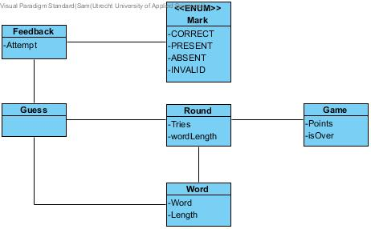

# CISQ1: Lingo Trainer

This project is part of a sophomore Software Development 
*Continuous Integration and Software Quality 1 (CISQ1)* at the 
Institute for ICT of the [Hogeschool Utrecht](https://www.hu.nl/).

### Author
    Sam Werring (1777733)
    Student Software Development
    2022/2023
###
### Technologies
- Java
- Maven
- Spring Boot [Latest]
- PostgreSQL [Latest]
- Lombok [1.18.22]
- JUnit [Latest]
- Jacoco [0.8.5]
- pitest [1.7.3]
- Postman
- Docker
###
### Design
####Class diagram conceptual

####Class diagram implementation

###
### Introduction
Lingo Trainer is a back-end API for practicing the popular Dutch word-game 'Lingo'. The game has now gained more popularity internationally under the name 'Wordle'.  
The project is fully unit, integration, system and end-to-end tested using JUnit 5. Using GitHub Actions for CI, the application is fully tested through a pipeline.
Data is persisted using a PostgreSQL database utilising Spring Data JPA. The entire project is designed and built around the 4 layer architecture.
    
### Project setup
1. Ensure environment variables in `docker-compose.yml` match the given credentials in `src/main/resources/application.properties`.
2. Run `docker-compose up` to start the PostgreSQL service in a Docker container.  
3. Verify the project's integrity with Maven, by running `mvnw verify`.  

The project is now ready.

###Tests
####Intellij Test Coverage

####Jacoco Test Coverage

####Pit Test Coverage

### Examples
####Start game example

####Make guess example
